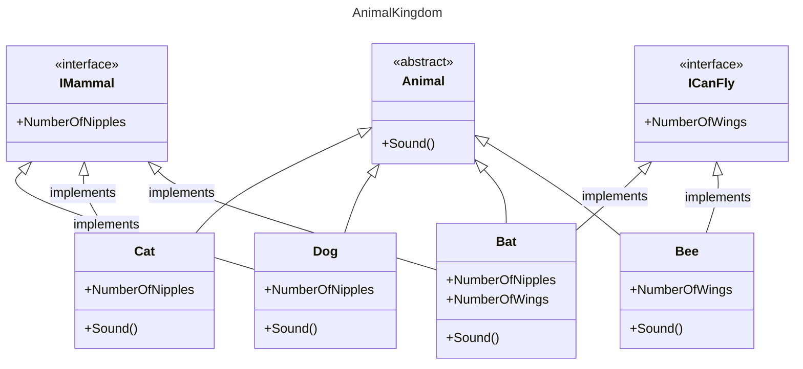

```mermaid
---
title: AnimalKingdom
author: Alexandre Almeida
format: pdf
---
classDiagram
    Animal <|-- Cat
    Animal <|-- Dog
    Animal <|-- Bat
    Animal <|-- Bee
    IMammal <|-- Dog : implements
    IMammal <|-- Cat : implements
    IMammal <|-- Bat : implements
    ICanFly <|-- Bat : implements
    ICanFly <|-- Bee : implements
    class IMammal{
        <<interface>>
        +NumberOfNipples
    }
    class ICanFly{
        <<interface>>
        +NumberOfWings
    }
    class Animal{
        <<abstract>>
        +Sound()
    }
    class Dog{
        +NumberOfNipples
        +Sound()
    }
    class Cat{
        +NumberOfNipples
        +Sound()
    }
    class Bat{
        +NumberOfNipples
        +NumberOfWings
        +Sound()
    }
    class Bee{
        +NumberOfWings
        +Sound()
    }
```